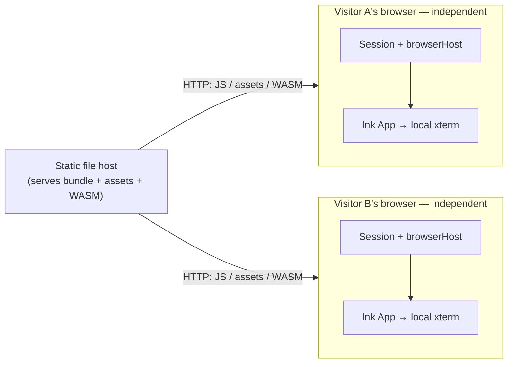

# Architecture

SpectralPrism Tracker's web deployment is a purely static, client-side app: a
plain file host serves the bundle once per page load, and each visitor's browser
runs its own `Session`, host, and terminal with no shared process or state
(HC005, target of FEAT-173…184). The desktop app shares the same `src/core` and
TUI code and runs the same Ink UI directly against a real terminal (HC003).

