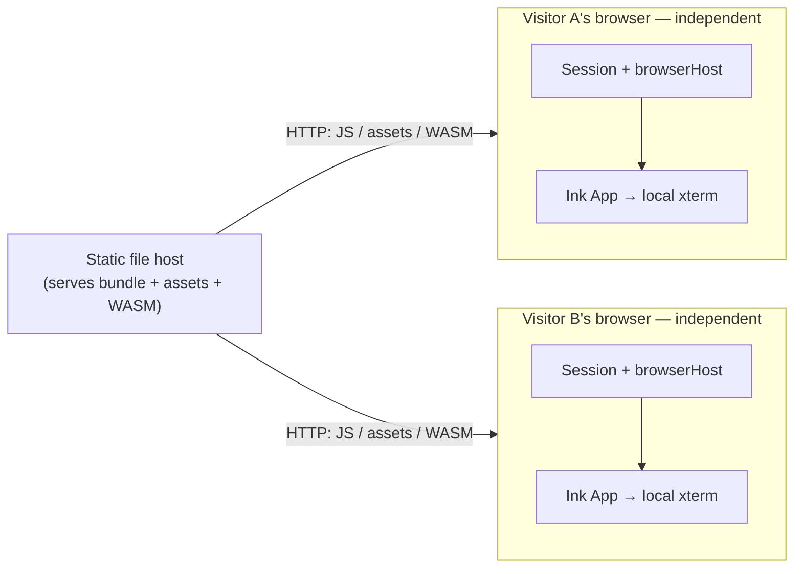
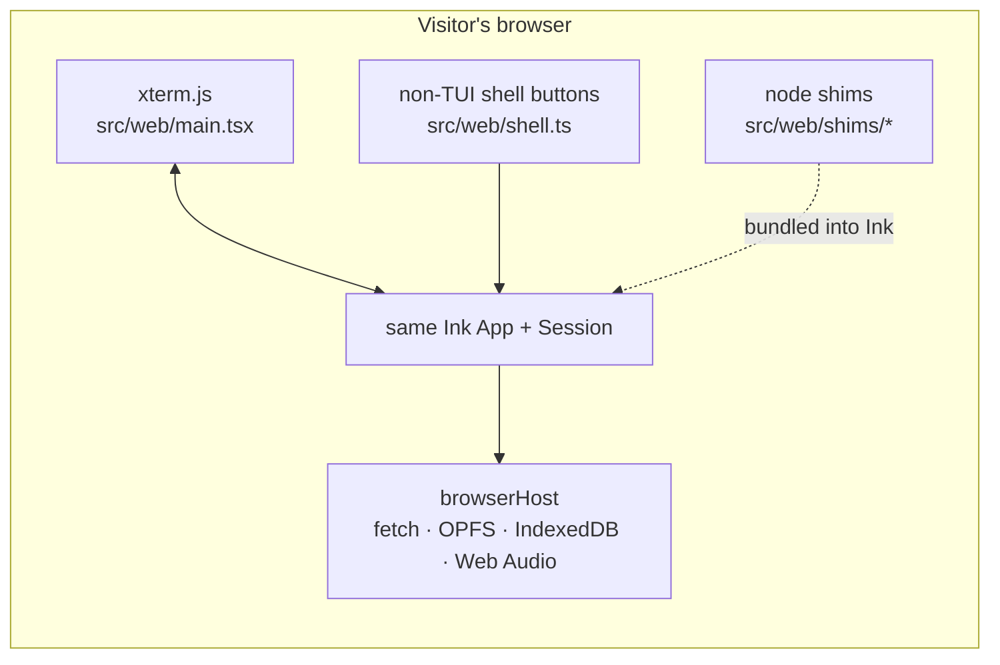
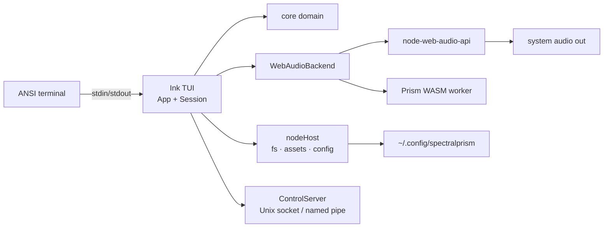

# Architecture

SpectralPrism Tracker is **one TUI, two front ends, many platforms**. The same
Ink TUI and the same `Session` action surface run everywhere; only the _host_
(platform seam) and the transport around the TUI change.

- **Web**: a purely static, client-side app. A plain file host serves the
  bundle, and every visitor's browser runs its own `Session`, browser host and
  local terminal — no shared process, no server-side session, no signal across
  visitors (HC005).
- **Desktop**: Node runs the same Ink TUI directly against a real terminal
  (HC003).

`src/core/` is framework-free and has no Node/DOM/Ink imports, so it is usable
from tests, the audio engine, and both front ends.

## 1. Solitary instances, one per visitor (HC005)

## 2. Browser runtime

`src/web/main.tsx` is the entrypoint. It installs `browserHost`, creates a
`Session`, and renders the same `App` used on the desktop into a **local**
xterm.js terminal via `ink.render(<App/>, { stdout, stdin })`, using the
browser-safe stream shims in `src/web/terminalStreams.ts`. The xterm input and
size feed Ink directly; the shell buttons call the same in-process command
surface.

Ink and its dependencies import a handful of Node builtins. The Vite web build
aliases those to tiny browser shims under `src/web/shims/`
(`process`, `stream`, `events`, `fs`, `os`, `tty`, `child_process`, `path`,
`vm`, `assert`, `module`, `ws`). The shims exist only for the browser bundle;
the desktop esbuild build is untouched.

## 3. Desktop runtime

`npm run dev:tui` builds `src/tui/main.tsx` with esbuild and runs it under
Node ≥ 22.

## 4. Dependency rules

- `src/core` never imports Node, DOM, or Ink — it stays pure and testable.
- `src/tui` never imports `node:` directly; all platform access goes through the
  `Host` interface (`src/host`), installed once per entrypoint via `setHost()`.
- Behaviour belongs in `Session` (or a pure helper in `src/core`) and is exposed
  as a command; the TUI, the control socket, and scripts share that one
  implementation.
- `src/web` must stay static and host-free: no `node:http`, no `createServer`,
  no `setHost(nodeHost)` (enforced by HC005).

## 5. Build & distribution

| Command              | Output                                                      |
| -------------------- | ----------------------------------------------------------- |
| `npm run build:tui`  | `dist/tui/` — desktop TUI bundle (`main.mjs`, `spt`)        |
| `npm run build:web`  | `dist/web/` — static client (serve with any file host)      |
| `npm run build:dist` | `dist/spectralprism-tracker/` runnable folder (+ `.tar.gz`) |

See [PLATFORMS.md](./PLATFORMS.md) for OS-sensitive paths.
